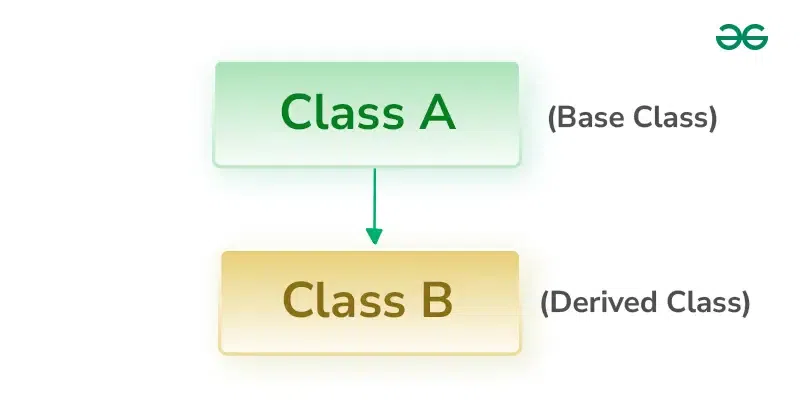

Inheritance C++

1. Single Inheritance

In single inheritance, a class is allowed to inherit from only one class. i.e. one base class is inherited by one derived class only.

2. Base class access specification 

**protected** : 

when it's only accesible from the instance of a class (or a child class)

**private** :

only from a class (not from a child);
we cannot acces private members of a base class without using a getter/setter;

**public** :

from anywhere
